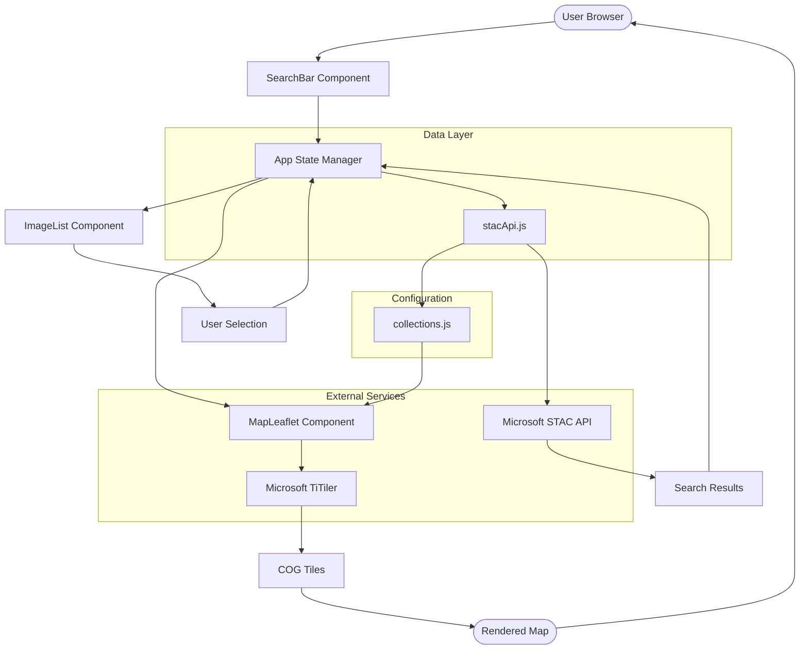

# Architecture Documentation

Satellite Data Viewer is a client-side React app that queries Microsoft Planetary Computer's STAC API and renders COG tiles via TiTiler. Built on a config-driven pattern with centralized collection metadata.

## System Flow



## Project Structure

```
sat-data-viewer/
├── src/
│   ├── components/
│   │   ├── MapLeaflet.jsx       # Leaflet map with tile overlays and measurements
│   │   ├── Map.css              # Map styling, legends, and controls
│   │   ├── SearchBar.jsx        # Search form with collection selector
│   │   ├── SearchBar.css        # Search bar styling
│   │   ├── ImageList.jsx        # Results list with band selectors
│   │   └── ImageList.css        # Image list and band button styling
│   ├── config/
│   │   └── collections.js       # Centralized satellite collection config
│   ├── utils/
│   │   └── stacApi.js           # STAC API integration & formatting
│   ├── App.jsx                  # Main application & state management
│   ├── App.css                  # App layout with Earth background
│   ├── main.jsx                 # React entry point
│   └── index.css                # Global styles and CSS variables
├── public/
│   └── earth_clean.png          # Background image
├── vite.config.js               # Vite configuration
├── package.json                 # Dependencies
├── README.md
├── ARCHITECTURE.md              # This file
├── LICENSE.md
└── CONTRIBUTING.md
```

## Components

### App.jsx
Main state container. Manages search results, selected images, band selections, and coordinate ranges. Orchestrates data flow between child components.

### SearchBar.jsx
Collection selector and search parameters. Dynamically shows/hides filters based on collection type (cloud cover for optical, date range for temporal data, etc.). Reads from `collections.js` config.

### ImageList.jsx
Displays search results with thumbnails and metadata. Band selector layout is driven by config. Handles image selection and band switching.

### MapLeaflet.jsx
Leaflet map with COG tile rendering, legends, measurement tools, and base layer switching. Uses `buildTileUrl()` from config to construct TiTiler URLs. Measurement tools use leaflet-draw + Turf.js for geodesic calculations.

### collections.js
Single source of truth for all satellite collections. Defines bands, rescale values, colormaps, legends, filters, and metadata display options. Components read this config instead of hardcoding collection logic.

### stacApi.js
Handles STAC API queries. Reads collection config to determine which filters to include (datetime, cloud cover). Formats raw STAC items for app consumption.

## Tile Rendering

TiTiler URLs are built from config:
```
/tiles/{z}/{x}/{y}?collection={c}&item={id}&assets={band}&rescale={min,max}&colormap_name={map}
```

Visual (TCI) bands have no rescale/colormap. Single bands (NIR, SWIR, etc.) use rescale and colormap from config.

## Adding a Collection

Edit `src/config/collections.js`:

```javascript
'new-collection-id': {
  name: 'Collection Name',
  displayName: 'Dropdown Label',
  type: 'optical',
  hasCloudFilter: true,
  hasDateFilter: true,
  defaultBand: 'visual',
  bands: {
    'band-id': {
      label: 'Button Label',
      assets: ['asset-name'],
      rescale: '0,4000',
      colormap: 'inferno',
      legend: { title: 'Title', min: '0', max: '4000', gradient: '...' }
    }
  },
  bandLayout: 'grid',
  metadata: { showCloudCover: true, showTileId: true }
}
```

The UI automatically updates. No component code changes needed.

## Dependencies

- React 19 + Vite 7.2.4
- Leaflet + leaflet-draw
- Turf.js (@turf/area, @turf/length)
- Axios 1.13.4
- CSS custom properties for theming

